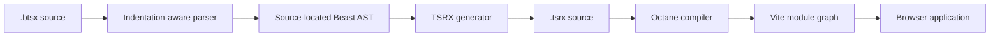

<!-- markdownlint-disable MD013 -->

# Beast

> An indentation-first component language that compiles BTSX into native TSRX
> for Octane.

[](#project-status)
[](package.json)
[](package.json)
[](https://octanejs.dev/)
[](LICENSE)

**Write the structure. Keep the types. Let Octane own rendering.**

[Quick start](#quick-start) ·
[How it works](#how-it-works) ·
[Language reference](#language-reference) ·
[Examples](examples/README.md) ·
[Octane coverage](docs/octane-coverage.md) ·
[CLI reference](#cli-reference) ·
[Vite integration](#vite-integration) ·
[Development](#development)

---

Beast is a small, source-located compiler for authoring
[TSRX](https://tsrx.dev/) components with indentation instead of closing tags.
It turns `.btsx` files into readable `.tsrx`, preserves native Octane template
control flow, and integrates with [Octane](https://octanejs.dev/) and
[Vite](https://vite.dev/) for application builds.

Beast does not replace TypeScript, TSRX, Octane, or Vite. It owns the compact
authoring layer and hands generated TSRX to the existing toolchain for final
validation, lowering, development serving, and production bundling.

## At a glance

| Capability | What it does | Why it matters |
| --- | --- | --- |
| BTSX compiler | Converts indentation-based `.btsx` into native `.tsrx` | Keeps generated output inspectable |
| Component setup | Emits local TypeScript and Octane hooks before the template root | Keeps stateful components self-contained |
| Native control flow | Emits Octane condition, loop, switch, and boundary directives | Preserves TSRX semantics and identity |
| Project builder | Recursively compiles BTSX and validates native TSRX | Supports mixed source trees |
| Vite integration | Runs Beast before Octane in memory | Enables normal dev and production builds |
| Diagnostics | Reports stable codes with file and source spans | Makes compiler failures actionable |
| Project creator | Scaffolds a typed Beast, Octane, and Vite application | Provides a coherent starting point |

## Quick start

Create a project with Bun:

```bash
bun create beast@latest
```

Pass a directory to skip the prompt:

```bash
bun create beast@latest my-app
cd my-app
bun run dev
```

The equivalent direct package-executor form is:

```bash
bun x create-beast@latest my-app
```

The generated project includes:

- Beast and Octane configured as one Vite compilation pipeline
- A typed `App.btsx` component
- TSRX-aware TypeScript checking through `tsrx-tsc`
- Development, production build, preview, type-check, and combined check scripts
- A focused `.gitignore` and an optional initialized Git repository

Creator options:

| Option | Effect |
| --- | --- |
| `--no-install` | Write the project without running `bun install` |
| `--no-git` | Skip `git init` |
| `--force` | Write known template files into a non-empty directory without deleting unrelated files |
| `-h`, `--help` | Print command help |

## How it works



Beast deliberately generates native TSRX rather than TSX-shaped intermediate
code. Conditions and loops remain template operations, component output stays
readable, and Octane remains the authority for TSRX syntax and runtime
compilation.

Given this BTSX:

```btsx
import AdminPanel from "./AdminPanel.btsx";
props { user, unreadCount, messages }: { user: { name: string; id: string; isAdmin: boolean }; unreadCount: number; messages: { id: string; text: string }[] }

.card
  .header
    h1 Welcome, #{user.name}
  .body
    if user.isAdmin
      AdminPanel(userId={user.id})
    else
      p You have #{unreadCount} new messages
    ul.messages
      each message, i in messages key message.id
        li.message #{message.text}
```

Beast produces this TSRX shape:

```tsrx
import AdminPanel from "./AdminPanel.btsx";

export default function Card({
	user,
	unreadCount,
	messages,
}: {
	user: { name: string; id: string; isAdmin: boolean };
	unreadCount: number;
	messages: { id: string; text: string }[];
}) @{
	<div className="card">
		<div className="header">
			<h1>Welcome, {user.name}</h1>
		</div>
		<div className="body">
			@if (user.isAdmin) {
				<AdminPanel userId={user.id} />
			} @else {
				<p>You have {unreadCount} new messages</p>
			}
			<ul className="messages">
				@for (const message of messages; index i; key message.id) {
					<li className="message">{message.text}</li>
				}
			</ul>
		</div>
	</div>
}
```

The CLI and project builder validate generated TSRX with Octane by default.
Validation can be disabled for constrained compiler-only environments, but it
should remain enabled in normal development and release workflows.

## Language reference

### Elements and nesting

Indentation defines the template tree. Indentation must use spaces; tabs are
rejected with a source-located diagnostic.

```btsx
main.page
  section#intro.hero
    h1 Beast
    p Indentation becomes structure.
```

Selectors follow a compact CSS-like form:

| BTSX | Meaning |
| --- | --- |
| `section` | HTML element |
| `Card` | Component reference |
| `Theme.Provider` | Dotted component reference |
| `.card` | `div` with class `card` |
| `section.hero` | `section` with class `hero` |
| `section#intro.hero` | `section` with ID `intro` and class `hero` |

Capitalized tag names are treated as component references. Referenced
components can be imported at the top of the BTSX file or otherwise be in
scope in the eventual TSRX module. PascalCase or `_`/`$` segments after a
capitalized tag are preserved as a dotted component API, so `Theme.Provider`
emits `<Theme.Provider>`. A lowercase dotted suffix remains class shorthand:
`Card.featured` emits `<Card className="featured">`.

### Module code, imports, local components, props, and setup

Top-level `module`, `import`, `component`, `props`, and `setup` declarations
make a component self-contained. They must appear before the first template
node. Imports and props occupy one physical line; module and setup source can
be inline or use an indented block.

```btsx
import UserCard from "./UserCard.btsx";
import type { User } from "./types.ts";
props { user, compact = false }: { user: User; compact?: boolean }

UserCard(user={user} compact={compact})
```

Imports are copied into generated TSRX in source order. Beast stores their
contents as source slices and lets Octane perform final TypeScript syntax
validation. A component may have one `props` declaration; its contents are the
complete typed function parameter, with an optional trailing semicolon.
Explicit `propsParam` options in the CLI, programmatic API, project builder, or
Vite plugin override the source declaration.

`module` emits TypeScript at module scope. Use it for directives, types,
context values, constants, and helper functions. A module directive such as
`"use strong"` must remain before imports, just as it would in native TSRX:

```btsx
module
  "use strong";
  const shortcutKey = "/";

import { useEffect, useRef } from "octane";
```

The `component` declaration defines a local component using the same tagless
BTSX syntax as the default component. Its optional `props` and `setup`
declarations must precede its template. This keeps module-scoped Context and
its consumers self-contained without embedding TSRX tags in BTSX:

```btsx
import { createContext, use } from "octane";
module
  interface ThemeProviderProps { theme: string }
  const Theme = createContext("light");

component ThemeLabel
  setup const currentTheme = use(Theme);
  p #{"Current theme: " + currentTheme}
props { theme }: ThemeProviderProps

Theme.Provider(value={theme})
  ThemeLabel
```

`use(Theme)` and `useContext(Theme)` both pass through unchanged. See the
complete [provider golden](examples/provider/provider.btsx), which exercises
both readers below a dotted provider.

`setup` emits TypeScript inside the component's `@{ ... }` body before its
rendered root. This is where local values and Octane hooks live. The inline
form holds one statement; the block form holds multiline source such as an
effect with cleanup:

```btsx
import { useEffect, useMemo, useState } from "octane";
props { initialCount, onCountChange }: { initialCount: number; onCountChange: (count: number) => void }
setup const [count, setCount] = useState(initialCount);
setup const doubled = useMemo(() => count * 2);
setup useEffect(() => onCountChange(count));

button(type="button" onClick={() => setCount(count + 1)}) Count: #{count}, doubled: #{doubled}
```

Dependency arguments are intentionally omitted in this example so Octane can
infer them from each closure. See the complete [counter golden](examples/counter/counter.btsx).

For editable state that follows a changing source, use Octane's
`useLinkedState`. Text fields use the browser-native `onInput` event for each
edit:

```btsx
module "use strong";
import { useLinkedState } from "octane";
props { user }: { user: { id: string; name: string } }
setup const [name, setName] = useLinkedState(user.id, () => user.name);

input(value={name} onInput={(event) => setName(event.currentTarget.value)})
```

This keeps local edits while `user.id` is unchanged and reconciles immediately
when the source changes. See the complete [editor golden](examples/editor/editor.btsx).

Indented source blocks end at the next nonblank line aligned with the
declaration. Beast removes their common source indentation while preserving
relative indentation, comments, and blank lines. It does not parse or rewrite
the TypeScript; Octane performs final syntax validation and hook lowering. See
the multiline [shortcut golden](examples/shortcut/shortcut.btsx).

Refs are ordinary expression attributes. Octane accepts object refs, callback
refs with optional cleanup, and nested arrays combining either form:

```btsx
import { useRef } from "octane";
setup
  const inputRef = useRef<HTMLInputElement | null>(null);
  const reportInput = (element: HTMLInputElement | null) => {
    onAttach(element);
    if (element !== null) return () => onAttach(null);
  };

input(ref={[inputRef, reportInput]})
```

The same `ref={...}` attribute can be passed to a component that declares a
ref prop; Beast does not require or insert a forwarding wrapper. See the
complete [refs golden](examples/refs/refs.btsx).

The remaining component hook APIs use the same setup passthrough. The
[advanced hooks golden](examples/hooks/hooks.btsx) combines an initialized
`useReducer` (including its current-state getter), `useId`, `useCallback`,
`memo`, `useEffectEvent`, `useImperativeHandle`, insertion/layout effects, and
`useDebugValue` in one component. For example:

```btsx
setup
  const [count, dispatch, getCount] = useReducer(reduceCount, initialCount, (value) => value * 2);
  const descriptionId = useId();
  const increment = useCallback(() => dispatch({ type: "increment" }));
  const reportLatest = useEffectEvent(() => onReport(getCount()));
  useImperativeHandle(handleRef, () => ({ read: getCount }));
  useLayoutEffect(() => onPhase("layout"));

section(aria-labelledby={descriptionId})
  h2(id={descriptionId}) Advanced hooks
  button(type="button" onClick={increment}) Increment
  button(type="button" onClick={reportLatest}) Report latest
```

Octane infers dependencies when the optional arrays are omitted. The
conformance test checks the lowered hook slots and server rendering, including
the rule that insertion/layout effects and imperative handle attachment do not
run during SSR.

For state already owned outside Octane, keep subscription and snapshot
functions stable at module scope, then call `useSyncExternalStore` from setup.
Its third argument provides a deterministic server snapshot:

```btsx
import { useSyncExternalStore } from "octane";
module
  function subscribe(onStoreChange: () => void) {
    window.addEventListener("online", onStoreChange);
    return () => window.removeEventListener("online", onStoreChange);
  }
  function getSnapshot() { return navigator.onLine; }
  function getServerSnapshot() { return true; }
setup const isOnline = useSyncExternalStore(subscribe, getSnapshot, getServerSnapshot);

p(role="status") #{isOnline ? "Online" : "Offline"}
```

The complete [network golden](examples/network/network.btsx) subscribes to both
browser connectivity events and cleans them up. Its conformance test also
executes the server-compiled component, proving SSR uses `getServerSnapshot`
without reading browser globals.

Responsive updates use normal setup hooks as well. Keep controlled input state
urgent, pass a deferred copy to slower output, and reserve transitions for
updates where the current screen remains useful:

```btsx
import { useDeferredValue, useState, useTransition } from "octane";
setup const [tab, setTab] = useState("overview");
setup const [isPending, startTransition] = useTransition();
setup const [query, setQuery] = useState("");
setup const deferredQuery = useDeferredValue(query);

button(onClick={() => startTransition(() => setTab("activity"))}) #{isPending ? "Opening…" : "Activity"}
input(value={query} onInput={(event) => setQuery(event.currentTarget.value)})
SearchResults(query={deferredQuery})
```

`useDeferredValue` is not a debounce; it controls which render may lag rather
than imposing a fixed delay. See the complete
[responsive golden](examples/responsive/responsive.btsx).

View transitions wrap the DOM region whose visual state should animate. Start
the update as a transition, and use `addTransitionType` when one boundary needs
different classes for different navigation directions:

```btsx
import { ViewTransition, addTransitionType, startTransition, useState } from "octane";
module type Tab = "overview" | "activity";
setup const [tab, setTab] = useState<Tab>("overview");
setup
  const selectTab = (next: Tab) => {
    startTransition(() => {
      addTransitionType(next === "activity" ? "forward" : "backward");
      setTab(next);
    });
  };

button(onClick={() => selectTab("activity")}) Activity
ViewTransition(name="project-panel" update={{ default: "panel-update", forward: "slide-left", backward: "slide-right" }})
  article #{tab === "overview" ? "Overview" : "Activity"}
```

Beast preserves the boundary, callbacks, and class maps as native Octane
component props. The complete
[transitions golden](examples/transitions/transitions.btsx) also covers enter
and exit classes, typed navigation state, Octane's client preload hint, and
server transition annotations.

Advanced integrations can use `ViewTransitionPseudoElement` to target a
boundary's group, image-pair, old, or new pseudo-element through the Web
Animations API. The conformance suite verifies its selector, animation options,
and filtered `getAnimations()` result, and also checks Octane's exported
`version` against Beast's pinned dependency.

Portals use a normal module helper that returns `createPortal`. A tagless local
component can be passed as the portal body, so BTSX does not need to embed a
TSRX fragment inside the call:

```btsx
import { createPortal } from "octane";
module
  interface SavedToastProps { target: HTMLElement; onDismiss: () => void }
  function SavedToast({ target, onDismiss }: SavedToastProps) {
    return createPortal(ToastBody, target, { onDismiss });
  }

component ToastBody
  props { onDismiss }: { onDismiss: () => void }
  aside.toast
    p(role="status") Draft saved.
    button(type="button" onClick={onDismiss}) Dismiss
props { target, onDismiss }: SavedToastProps

SavedToast(target={target} onDismiss={onDismiss})
```

The optional third argument supplies props to the portal body. The complete
[portal golden](examples/portal/portal.btsx) keeps the physical overlay under
its logical Beast parent so Octane can preserve context and event ancestry.

Library code can create and adapt renderable descriptors without embedding
TSRX tags inside setup. `Children` supplies React-shaped traversal helpers,
while `isValidElement` and `isChildrenBlock` distinguish descriptors from a
compiled component-children function:

```btsx
import { Children, cloneElement, createElement, isValidElement } from "octane";
setup
  const base = createElement("li", { key: "base" }, "Base");
  const cloned = cloneElement(base, { className: "selected" }, "Cloned");
  const mapped = Children.map([base, null, cloned], (child, index) =>
    isValidElement(child) ? cloneElement(child, { "data-index": index }) : child
  );

ul
  | #{mapped}
```

Resource hints are also ordinary setup calls. `preload`, `preinit`,
`preloadModule`, `preinitModule`, `preconnect`, and `prefetchDNS` pass through
to Octane, which deduplicates them and collects their server tags ahead of the
rendered body. The complete [library golden](examples/library/library.btsx)
executes all descriptor/inspection helpers and all six resource APIs.

Form actions can combine action-owned state, descendant status, optimistic
output, and an uncontrolled-field reset. The optimistic update belongs inside
the action, while `useFormStatus` belongs in a component rendered beneath the
form:

```btsx
import { requestFormReset, useActionState, useFormStatus, useOptimistic, useRef } from "octane";
module
  interface EditNameProps {
    names: readonly string[];
    saveName: (name: string) => Promise<void>;
  }

component SubmitButton
  setup const { pending } = useFormStatus();
  button(type="submit" disabled={pending}) #{pending ? "Saving…" : "Save"}
props { names, saveName }: EditNameProps
setup
  const formRef = useRef<HTMLFormElement | null>(null);
  const [optimisticNames, addOptimisticName] = useOptimistic(names, (current, name: string) => [...current, name]);
  const [message, submit] = useActionState(async (_previous: string, data: FormData) => {
    const name = String(data.get("name") ?? "").trim();
    if (!name) return "Enter a name before saving.";
    addOptimisticName(name);
    await saveName(name);
    if (formRef.current !== null) requestFormReset(formRef.current);
    return "Saved " + name + ".";
  }, "Save a name.");

form(ref={formRef} action={submit})
  input(name="name" defaultValue="Ada")
  SubmitButton
p #{message}
```

The complete [actions golden](examples/actions/actions.btsx) also validates
empty input, exposes the pending form data to its submit button, and renders
the optimistic collection.

### Attributes

Attributes live in parentheses and may be separated by spaces or commas:

```btsx
Button(tone="primary" count={items.length} disabled) Continue
```

| Form | Output behavior |
| --- | --- |
| `name="value"` | Quoted string attribute |
| `name='value'` | Single-quoted string attribute |
| `name={expression}` | TypeScript expression attribute |
| `disabled` | Boolean attribute |
| `{...props}` | Ordered TypeScript spread attribute |

`class` is normalized to `className`. Selector shorthand and an explicit class
are combined; conflicting ID declarations and duplicate explicit class
attributes are rejected. Spreads retain their authored position relative to
named attributes, so later entries keep normal TSRX override precedence.

### Text and interpolation

Inline text follows an element selector. Use `#{...}` to embed an expression:

```btsx
p Hello, #{user.name}. You have #{messages.length} messages.
```

Use a pipe for a line that should be interpreted only as text:

```btsx
div.notice
  | This line is text, not an element selector.
```

Literal text is escaped in generated TSRX. Embedded expressions remain source
slices and receive their final syntax validation from Octane.

### Explicit fragments and scoped styles

Use `fragment` when a specific subtree should compile to a native TSRX
fragment, even when Beast would not need to insert one automatically:

```btsx
fragment
  Header
  main Content
```

A `style` node consumes its indented body as raw CSS. Octane scopes its
selectors to the owning component, stamps the matching scope class on rendered
elements, and collects the stylesheet during server rendering. Wrap a selector
in `:global(...)` when it must remain unscoped:

```btsx
fragment
  article.card({...cardProps})
    h2 #{title}
  style
    .card {
      padding: 1rem;
    }

    :global(body) {
      margin: 0;
    }
```

Beast removes only the CSS block's common source indentation and otherwise
preserves its text. See the complete
[styling golden](examples/styling/styling.btsx) for explicit fragments,
ordered prop spreading, scoped descendants, and a global escape.

### Conditions

`if`, `elseif`, and `else` compile directly to native `@if` control flow:

```btsx
if status === "ready"
  ReadyView
elseif status === "loading"
  LoadingView
else
  ErrorView
```

Branches must be adjacent and aligned at the same indentation level. Orphaned,
empty, duplicate, or post-`else` branches produce compiler diagnostics.

### Iteration and keys

Loops compile directly to native `@for` blocks:

```btsx
each item in items
  li #{item.label}

each item, index in items key item.id
  Row(item={item} position={index})

each result in results key result.id
  SearchResult(result={result})
empty
  p No matches.
```

The supported header is:

```text
each item[, index] in iterable [key expression]
```

For compatibility, a `key={expression}` attribute on a loop's single root
element is hoisted into the generated `@for` header. Beast never invents an
index key: keys affect keyed rendering and hook identity, so they must be
authored deliberately.

An aligned `empty` branch immediately after a loop compiles to Octane's native
`@empty` arm. It must contain at least one template node.

### Multiple choices

`switch`, `case`, and `default` compile to Octane's native `@switch` control
flow. Arms are isolated and do not use `break`:

```btsx
switch status
  case "ready"
    ReadyView
  case "loading"
    LoadingView
  default
    ErrorView
```

The switch expression and every case expression remain TypeScript source
slices for Octane to validate. Arms must be indented directly beneath their
switch, contain at least one template node, and include no more than one
`default`. A default arm is optional.

### Loading and error boundaries

`try` may be followed by `pending`, `catch`, or both. These compile directly to
Octane's `@try`/`@pending`/`@catch` template boundaries:

```btsx
try
  Profile(data={profileData})
pending
  p Loading profile…
catch error, reset
  .error
    p Could not load profile: #{String(error)}
    button(type="button" onClick={reset}) Try again
```

When both continuations are present, `pending` must come before `catch`. Catch
bindings may be omitted, written directly after `catch`, or surrounded by one
optional pair of parentheses. Their TypeScript binding syntax is preserved for
Octane to validate. Every authored boundary arm must contain at least one
template node.

Promise-valued `use()` is an ordinary setup call. Pending reads reach the
nearest `Suspense`, rejected reads reach `ErrorBoundary`, and fulfilled reads
continue into the component body:

```btsx
import { ErrorBoundary, Suspense, use } from "octane";

component AsyncProfile
  props { profile }: { profile: PromiseLike<ProfileData> }
  setup const resolved = use(profile);
  h2 #{resolved.name}

ErrorBoundary(fallback="Profile failed.")
  Suspense(fallback="Loading profile…")
    AsyncProfile(profile={profile})
```

The [async golden](examples/async/async.btsx) executes all three server
outcomes. It also covers `Activity` in `visible`, `hidden`, and `prerender`
modes; hidden content is omitted from server output while the other two modes
render their subtree.

Octane's component boundaries and hydration strategies compose through normal
imports, attributes, and nesting. A lazy component suspends into the nearest
`Suspense`; a rejected load reaches the nearest `ErrorBoundary`. `Hydrate`
keeps server-rendered content dormant until its strategy opens:

```btsx
import { ErrorBoundary, Hydrate, Suspense, lazy } from "octane";
import { visible } from "octane/hydration";
module const LazyAnalytics = lazy(() => import("./analytics.tsrx"));

ErrorBoundary(fallback="The dashboard could not be loaded.")
  Suspense(fallback="Loading analytics…")
    LazyAnalytics(reportId={reportId})
  Hydrate(when={visible({ rootMargin: "400px" })} split={false})
    ReviewSummary(reportId={reportId})
```

This focused form opts out of Hydrate's child-chunk extraction while still
deferring interactivity. See the complete
[deferred golden](examples/deferred/deferred.btsx).

The [hydration golden](examples/hydration/hydration.btsx) covers `load`, `idle`,
`visible`, `media`, `interaction`, `condition`, and `never`, including the
function form for browser-only strategy selection. It also exercises default
child splitting, strategy and procedural prefetching, `fallback`,
`onHydrated`, and the permanent-static `split={false}` plus `when={never()}`
form. Its conformance test compiles the extracted child query and executes the
server markers for every strategy.

Applications that may receive input before `hydrateRoot()` should call
`initializeHydrationEventCapture()` from their lightweight bootstrap. The API
is idempotent per document; Beast's test invokes it twice and verifies each
supported capture listener is installed only once.

### Client roots and existing-DOM behavior

Compiled Beast components use Octane's normal root lifecycle. Mount with
`createRoot(container).render(Component, props)`, or pass the server-rendered
component and matching props to `hydrateRoot(container, Component, props)` to
adopt its existing DOM. The returned root can update the same component in
place and owns its eventual `unmount()` cleanup.

`flushSync()` makes a scheduled DOM commit observable before the callback
returns. Tests and integration harnesses should use `act()` to settle render
work and insertion, layout, and passive effects before asserting. Beast's
executable DOM suite covers both APIs, full-root adoption, an
interaction-gated `Hydrate` boundary with first-event replay, and portal
mount/update/unmount behavior.

Existing markup that must not be reconciled can instead use
`attachBehaviorRoot()` from `octane/behavior`. Behavior roots adopt matching
elements, delegate events, and honor independently owned ranges while leaving
their DOM intact on normal disposal. This is an application-bootstrap API; it
does not require additional BTSX grammar.

### Server and static rendering

Server entry points consume the same component produced from BTSX; no separate
authoring syntax is required. Choose the renderer by delivery goal:

| Goal | Entry point |
| --- | --- |
| One synchronous hydratable pass | `renderToString` from `octane/server` |
| Marker-free HTML that will not hydrate | `renderToStaticMarkup` from `octane/server` |
| Progressive Node response | `renderToPipeableStream` from `octane/server` |
| Progressive Web `ReadableStream` | `renderToReadableStream` from `octane/server` |
| Fully resolved buffered output | `prerender` from `octane/static` |
| Fully resolved Node prelude | `prerenderToNodeStream` from `octane/static` |

Buffered renderers return separate `html` and deduplicated scoped `css`
channels. Head elements fold into `html` by default or can be requested through
the separate head channel. Streaming renders send a Suspense shell first and
reveal completed boundaries later; the Web form exposes `allReady` for final
completion. The renderer suite also verifies CSP nonces, request aborts,
per-render deadlines, and the global `setSsrSuspenseTimeout()` /
`getSsrSuspenseTimeout()` controls.

### Comments and roots

Lines beginning with `//` are omitted from output. A component with multiple
root nodes, no root node, a text-only root, or a style-only root is wrapped in
a TSRX fragment. An authored `fragment` always remains explicit in the output.

## CLI reference

After installing `beast-tsrx`, the `beast` binary supports single-component
compilation and recursive source-tree builds.

```text
beast compile <input.btsx> [options]
beast <input.btsx> [output.tsrx] [options]
beast build [source-directory] [options]
beast --help
```

### Compile a component

```bash
beast compile src/Card.btsx \
  --output generated/Card.tsrx \
  --component-name Card \
  --props '{ title }: { title: string }'
```

| Option | Description | Default |
| --- | --- | --- |
| `-o`, `--output PATH` | Write TSRX to a specific path | Input path with `.tsrx` extension |
| `--component-name NAME` | Override the generated component identifier | Derived from the filename |
| `--props PARAMETER` | Override the complete function parameter, including its type | Source declaration or empty parameter list |
| `--no-validate` | Skip Octane validation | Validation enabled |

The output path must differ from the input path. Parent directories are
created as needed.

### Build a source tree

```bash
beast build ./src --out-dir ./.beast
```

| Argument or option | Description | Default |
| --- | --- | --- |
| `source-directory` | Root recursively searched for `.btsx` and `.tsrx` | Current directory |
| `--out-dir PATH` | Mirrored destination for generated TSRX | `<source-directory>/.beast` |
| `--no-validate` | Skip validation of generated and native TSRX | Validation enabled |

The builder ignores `.git`, `.beast`, `build`, `coverage`, `dist`, and
`node_modules`. Discovery and manifest entries are sorted for deterministic
output.

Each build writes `beast-manifest.json` with the generated source path, output
path, component name, and validated native TSRX files. Native `.tsrx` files are
validated in place; they are not copied into the output directory.

After all current inputs compile and validate, Beast removes outputs recorded
by the previous manifest that are no longer generated. Cleanup accepts only
canonical `.tsrx` paths inside the output directory, skips symlinked parent
directories, prunes directories only when they become empty, and never removes
untracked files. Removed paths are returned as `result.removed` and reported by
the CLI.

The project builder does not replace an application bundler. Octane and Vite
remain responsible for producing a deployable application.

## Vite integration

Use `beastOctane()` for projects containing Beast and native TSRX modules:

```ts
// vite.config.ts
import { defineConfig } from "vite";
import { beastOctane } from "beast-tsrx/vite";

export default defineConfig({
  plugins: [
    beastOctane({
      octane: {
        strong: true,
      },
    }),
  ],
});
```

Then import both source types normally:

```ts
import App from "./App.btsx";
import { NativePanel } from "./NativePanel.tsrx";
```

The Beast pre-transform generates TSRX in memory and passes it to Octane's
public bundler compiler. Native `.tsrx` modules go through Octane's direct Vite
integration. HMR invalidation is forwarded for `.btsx` changes, and SSR
transforms select Octane's server environment. Compiler-split `Hydrate`
children re-enter their originating `.btsx` module through Octane's resource
query, so production builds can emit and activate the deferred chunk normally.

The `components` option remains available for per-file `componentName` and
`propsParam` overrides. Source-level props are preferred when a component owns
its public parameter type.

`beast()` is also exported for advanced configurations that only need the
BTSX pre-transform. Most applications should use `beastOctane()` exactly once.

## Rspack integration

Use the complete adapter with Octane's low-level Rspack plugin:

```bash
npm install octane@0.1.37
npm install --save-dev @rspack/core@^2 @octanejs/rspack-plugin@0.1.32
```

```js
// rspack.config.mjs
import { beastOctane } from "beast-tsrx/rspack";

export default {
  entry: "./src/main.ts",
  plugins: [
    beastOctane({
      octane: { strong: true },
    }),
  ],
};
```

The adapter compiles `.btsx`, leaves native `.tsrx` and compiler-owned helper
modules to Octane, selects client or server output from the Rspack target, and
registers source dependencies with Rspack's cache and watcher. Its `.tsrx`
extension fallback resolves compiler-split hydration requests back to the
originating `.btsx` module while preferring a real native `.tsrx` file.

`beast()` and `BeastRspackPlugin` are also exported for configurations that
already install `OctaneRspackPlugin` themselves.

## Rsbuild integration

The Rsbuild adapter composes Beast with Octane's full compiler and application
plugin:

```bash
npm install octane@0.1.37 @octanejs/rsbuild-plugin@0.1.32
npm install --save-dev @rsbuild/core@^2
```

```ts
// rsbuild.config.ts
import { defineConfig } from "@rsbuild/core";
import { beastOctane } from "beast-tsrx/rsbuild";

export default defineConfig({
  plugins: beastOctane({
    octane: { strong: true },
  }),
});
```

Without Octane routes this preserves ordinary Rsbuild entries. With an
`octane.config.ts`, render routes can point directly at `.btsx` modules and use
Octane's browser hydration and Node SSR environments. Inline compiler options
and the project's Strong-mode and renderer configuration are forwarded to the
BTSX transform. Use the exported Rsbuild `beast()` plugin alone when
`pluginOctane()` is already present.

## Programmatic API

### Compile source

```ts
import { compileBeast, compileBeastResult } from "beast-tsrx";

const code = compileBeast(source, {
  filename: "Card.btsx",
  componentName: "Card",
  propsParam: "{ title }: { title: string }",
});

const result = compileBeastResult(source, {
  filename: "Card.btsx",
});

console.log(result.ast, result.code, result.diagnostics);
```

### Build a project

```ts
import { buildBeastProject } from "beast-tsrx";

const result = await buildBeastProject({
  root: "src",
  outDir: ".beast",
  components: {
    "components/Card.btsx": {
      componentName: "Card",
      propsParam: "{ title }: { title: string }",
    },
  },
});

console.log(result.manifestPath, result.removed);
```

Component configuration keys are POSIX-style paths relative to the project
root. The same shape is accepted by the Vite integration.

### Exports

| Export | Purpose |
| --- | --- |
| `compileBeast()` | Compile BTSX source and return TSRX code |
| `compileBeastResult()` | Return generated code, the source-located AST, and diagnostics |
| `parse()` | Parse BTSX into the public Beast AST |
| `componentNameFromPath()` | Derive and sanitize a component identifier from a path |
| `buildBeastProject()` | Compile and validate a recursive source tree |
| `resolveProjectPath()` | Resolve project-relative configuration paths |
| `BeastCompileError` | Structured compiler error carrying a stable diagnostic |
| `formatDiagnostic()` | Render a diagnostic with source location and caret context |
| `beast()`, `beastOctane()` | Beast-only and complete Vite integrations from `beast-tsrx/vite` |
| `BeastRspackPlugin`, `beast()`, `beastOctane()` | Rspack integrations from `beast-tsrx/rspack` |
| `beast()`, `beastOctane()` | Rsbuild plugins from `beast-tsrx/rsbuild` |

Compiler and project exports are available from `beast-tsrx`; build-tool
adapters use their named subpaths above.

## Diagnostics

Parser and generator failures throw `BeastCompileError`. Each diagnostic
contains:

- A stable `BEAST####_*` code
- `error` or `warning` severity
- A human-readable message
- The source filename
- Start and end offsets, lines, and columns
- An optional remediation hint

The CLI renders the failing source line with a caret marker. Syntax that Beast
stores as embedded TypeScript source receives its final language-level
validation from Octane.

## Compatibility

| Tool | Supported version | Role |
| --- | --- | --- |
| Node.js | `>=22.22.2` | Required by the supported Octane toolchain |
| Bun | Current stable | Workspace, tests, project creation, and dependency installation |
| TypeScript | `^5.9.3` | Package declarations and generated-project checking |
| TSRX TypeScript plugin | `0.3.118` | `.tsrx` and `.btsx` project type checking |
| Octane | `0.1.37` | TSRX validation, lowering, and runtime |
| Vite | `^8.0.16` | Development server and production bundling |
| Octane Rspack/Rsbuild plugins | `0.1.32` | Bundler integration compatible with Octane `0.1.37` |
| Rspack / Rsbuild | `^2.0.0` | Low-level and application-level production builds |

Octane and TSRX are evolving. Beast pins the versions used by its conformance
suite and starter project so failures are reproducible.

## Correctness contract

The current suite and release checks verify the behavior Beast claims publicly:

- BTSX fixtures must match committed TSRX output byte for byte.
- Every golden TSRX fixture must compile through Octane without diagnostics.
- Every tracked Core API name must remain exported from its pinned public
  Octane entry point.
- Compiled client roots must mount, update, hydrate existing nodes, activate
  deferred boundaries, preserve portal event ancestry, and dispose owned work.
- Behavior-only roots must honor external ownership and retain existing DOM on
  disposal.
- Server renderers must preserve hydratable/static distinctions, stream
  Suspense completion through Node and Web transports, and bound async work.
- Recursive builds must mirror paths, emit a versioned manifest, and safely
  remove only stale outputs tracked by the previous manifest.
- Mixed `.btsx` and native `.tsrx` applications must complete production Vite,
  Rspack, and Rsbuild builds, including their covered server and split-module
  paths.
- The project creator must preserve unrelated files, refuse accidental writes
  to non-empty directories, and generate the expected toolchain configuration.
- Packed `beast-tsrx` and `create-beast` artifacts must install into a clean
  project whose type check and production build succeed.

These checks protect the current contract. They do not imply production
stability while Beast, Octane, and TSRX remain alpha-stage software.

## Repository structure

```text
beast/
├── src/
│   ├── ast.ts                   # Public source-located Beast AST
│   ├── parser.ts                # Indentation-aware BTSX parser
│   ├── codegen.ts               # Beast AST to native TSRX
│   ├── compiler.ts              # Public compilation entry points
│   ├── diagnostics.ts           # Structured errors and formatting
│   ├── project.ts               # Recursive source-tree builder
│   ├── vite.ts                  # Beast and Octane Vite integration
│   ├── rspack.ts                # Beast and Octane Rspack integration
│   ├── rspack-loader.ts         # Rspack BTSX-to-Octane transform
│   ├── rsbuild.ts               # Beast and Octane Rsbuild integration
│   └── cli.ts                   # `beast` command-line adapter
├── packages/create-beast/
│   ├── src/index.ts             # Project creator CLI and API
│   ├── template/                # Vite, Octane, TSRX, and BTSX starter
│   └── tests/create.test.ts      # Creator safety and output tests
├── examples/
│   ├── README.md                # Example index and usage notes
│   ├── actions/                 # Form actions, optimistic state, and reset
│   ├── app/                     # Imports and component composition
│   ├── async/                   # Promise use, Suspense outcomes, and Activity
│   ├── boundary/                # Loading and error template boundaries
│   ├── card/                    # Conditions and a hoisted loop key
│   ├── catalog/                 # Attributes and an explicit loop key
│   ├── counter/                 # Octane state, memo, and effect hooks
│   ├── deferred/                # Lazy boundaries and deferred hydration
│   ├── editor/                  # Linked controlled input and native events
│   ├── fragment/                # Multiple roots, text, and escaping
│   ├── hooks/                   # Reducer, effect phases, IDs, memo, and handles
│   ├── hydration/               # Strategies, prefetch, splitting, and capture
│   ├── library/                 # Descriptors, Children helpers, and resources
│   ├── network/                 # External-store subscription and SSR snapshot
│   ├── portal/                  # Cross-container rendering and logical ancestry
│   ├── provider/                # Context provider and consumer hooks
│   ├── refs/                    # Callback, object, and array refs
│   ├── responsive/              # Transitions and deferred search output
│   ├── shortcut/                # Multiline source and effect cleanup
│   ├── status/                  # Nested loops and branch chains
│   ├── styling/                 # Spreads, explicit fragments, and scoped CSS
│   ├── transitions/             # View-transition classes and typed directions
│   └── variant/                 # Multi-way switch output
├── docs/
│   └── octane-coverage.md       # Official-doc coverage map and roadmap
├── tests/
│   ├── compiler.test.ts         # Compiler and Octane behavior conformance
│   ├── bundlers.test.ts         # Rspack and Rsbuild production lifecycles
│   ├── core-api.test.ts         # Pinned public Core API export inventory
│   ├── project.test.ts          # Project builder and Vite tests
│   ├── runtime.test.ts          # Client hydration, roots, portals, and behavior
│   └── server.test.ts           # Buffered, streaming, and static rendering
├── package.json                 # `beast-tsrx` package and workspace root
└── tsconfig.json
```

## Development

Requirements: Node.js 22.22.2 or newer and Bun.

```bash
git clone https://github.com/phtn/beast.git
cd beast
bun install --frozen-lockfile
bun run check
```

| Script | Purpose |
| --- | --- |
| `bun run build` | Compile both publishable workspace packages |
| `bun run typecheck` | Type-check both packages without emitting files |
| `bun run test` | Run compiler, builder, Vite, and creator tests |
| `bun run check` | Run type checking, tests, and builds in sequence |
| `bun run pack:check` | Inspect both npm package tarballs without publishing |

When changing the language or generator:

1. Update the parser, AST, or generator at the smallest appropriate layer.
2. Add or revise a paired `.btsx` and `.tsrx` golden fixture when output changes.
3. Add diagnostic coverage for invalid syntax and ambiguous constructs.
4. Run `bun run check` and both package dry runs.
5. Confirm generated TSRX remains readable and valid through Octane.

Focused issues and pull requests are welcome. Changes should preserve
deterministic output, explicit keys, source-located failures, and the boundary
between Beast authoring syntax and Octane compilation.

## Project status

Beast is an alpha compiler with a deliberately narrow initial language. The
minimum compiler, recursive builder, Vite integration, and project creator are
working and tested; the language and public API may still change before a
stable release.

Current limitations:

- The CLI builder has no per-file configuration file; use the programmatic API
  or Vite component options.
- Beast-to-TSRX source maps are not implemented. Vite currently returns
  Octane's map for the generated TSRX layer.
- Standalone watch mode is not implemented; Vite owns watched application
  builds.
- Embedded expressions are preserved as source slices rather than parsed into
  a TypeScript expression AST by Beast.
- Tab indentation is intentionally unsupported.

See the [golden example index](examples/README.md) for focused BTSX inputs and
the exact generated TSRX output contract. The living
[Octane coverage map](docs/octane-coverage.md) separates supported runtime APIs
from BTSX syntax and integration work that still remains. Its public Core API
ledger is synced to the official API index and the pinned Octane types, and a
capability is marked covered only after its example or lifecycle test passes
the release checks. Every row in that ledger is covered for `octane@0.1.37`.

## License

Released under the [ISC License](LICENSE).

---

*A compact authoring layer for explicit, native Octane templates.*
